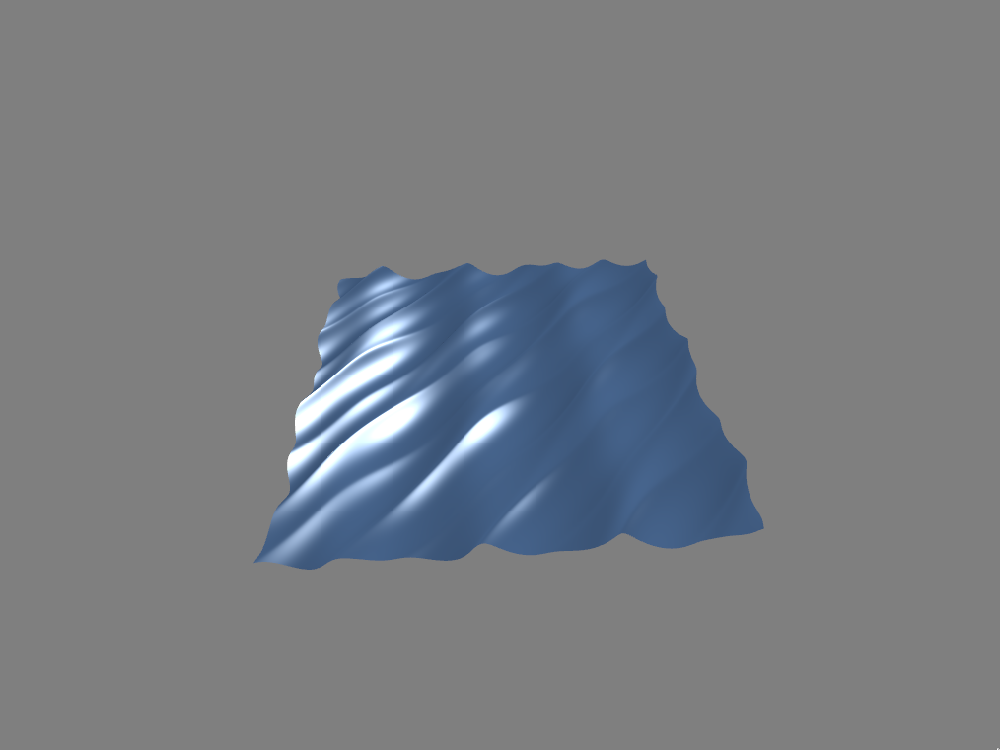

# Gerstner/Trochoidal Wave Simulation in OpenGL
This is a ocean wave simulation done in OpenGL and C++. It uses the Gerstner waves, a.k.a Trochoidal waves model. The idea behind it is that each vertex on the mesh moves in a circular motion, where as a sine wave just moves up and down.

For more information on Gerstner Waves checkout these useful links:
* https://en.wikipedia.org/wiki/Trochoidal_wave
* [Implementation in Unity shader](https://catlikecoding.com/unity/tutorials/flow/waves/)